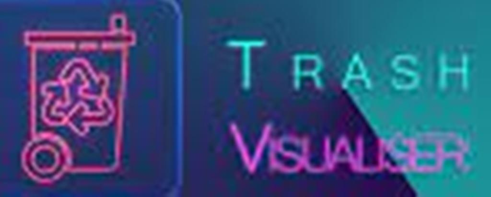
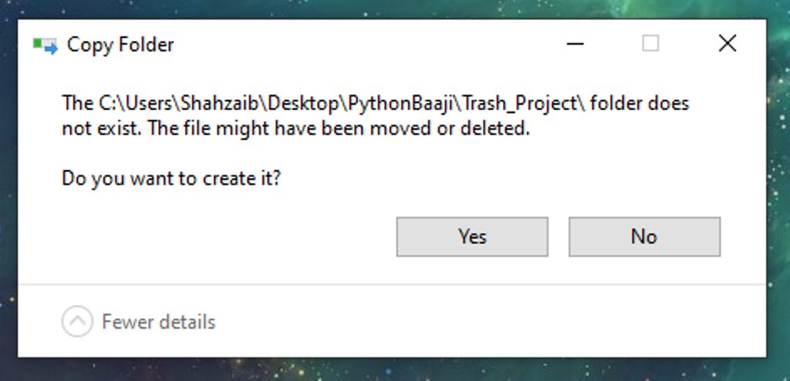
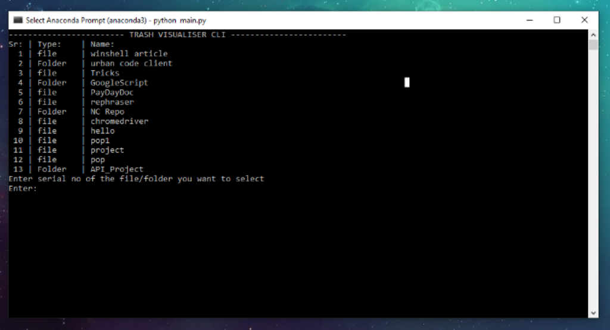
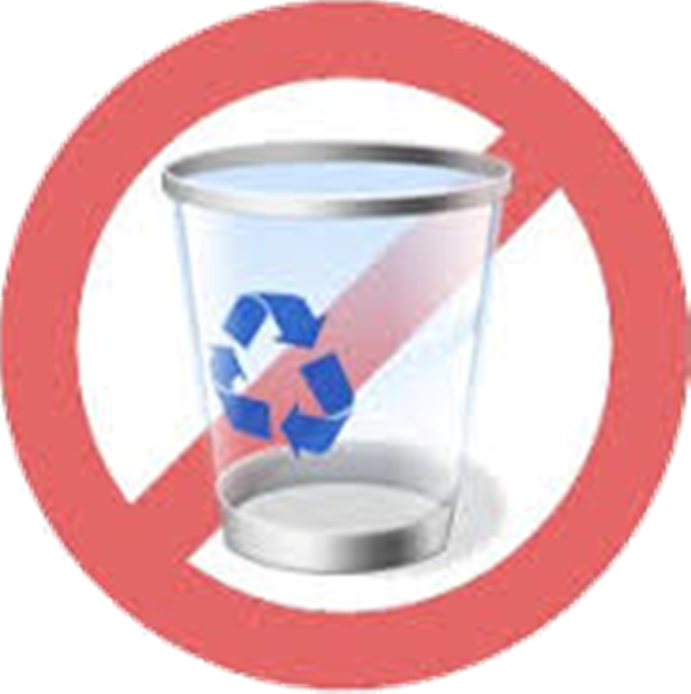

# ***Trash Visualizer ***

 * [Pre-requisites](#pre-requisites)
 * [How To Use](#how-to-use)
 * [Features](#features)
 * [Using CLI-Version](#using-cli-version)

This is GUI-based Python Desktop Application, that will show all your deleted items inside the Recycle-bin in a better visual representation. You'll be able to open those folders/ files in the GUI, as well as delete and restore them from the GUI, in an effective manner.


---

## ***Pre-requisites*** 
 ***winshell*** library should be installed in your system, before using this program. if not
Run this command
```python
pip install winshell
```
The GUI requires ***PyQt5 *** as well
```python
pip install PyQt5
```

---

## ***How To Use ***
start by cloning this repository 
```git
git clone https://github.com/WeilerWebServices/Trash-Visualiser.git
```
After cloning is successful
```bash
cd Trash-Visualizer
```
```python
python launcher.py
```

---


It may happen that the windows will ask you to create some folders that doesn't exist, these will be the folders that you'd have deleted once. 
Simply Click YES, this way the folders you once had deleted will be created again temporarily, so no need to Panic on that, let it happen. 


After a few seconds of processing, Trash-Visualizer Main Window will be opened

This Window will show all the deleted files/folders in your recycle bin.
Files and Folders are visualized separately.

---

## ***Features ***
 * Upon Single CLick on any File/Folder the details(properties) of it will be shown in the down right box.
 * Upon Double Click on any File:

 * If the Clicked File is .txt OR .py OR any other kind of source file that contains any kind of text in it, will be opened directly in the Window, so as you can view it.
 * Any other file other than text files (Source Code Files included), won;t be able to be opened, the program will show a message box saying that it can't be opened.

 * Upon Double CLick on a Folder, the Folder will be opened

 * You'll be able to open further files and folders inside that folder, and so on.

 * GO Back Button is found once you're inside any File or Folder, through which you can get back to the main window.
 * In Order to Restore or Delete a File/Folder Single click on it from the main window, you'll see its properties being shown, then CLick on RESTORE or DELETE button

 *RESTORE: The selected file/folder will be restores to its original location.
 *DELETE: The selected file/folder will be permanently deleted from the recycle-bin as well.


---

##  ***Using CLI-Version***
After cloning is successful, cd into the repository folder.
```bash
cd Trash-Visualiser/src/CLI/
```
```python
python main.py
```
The exact same operations will be performed but in Command Line Interface.


---



---
